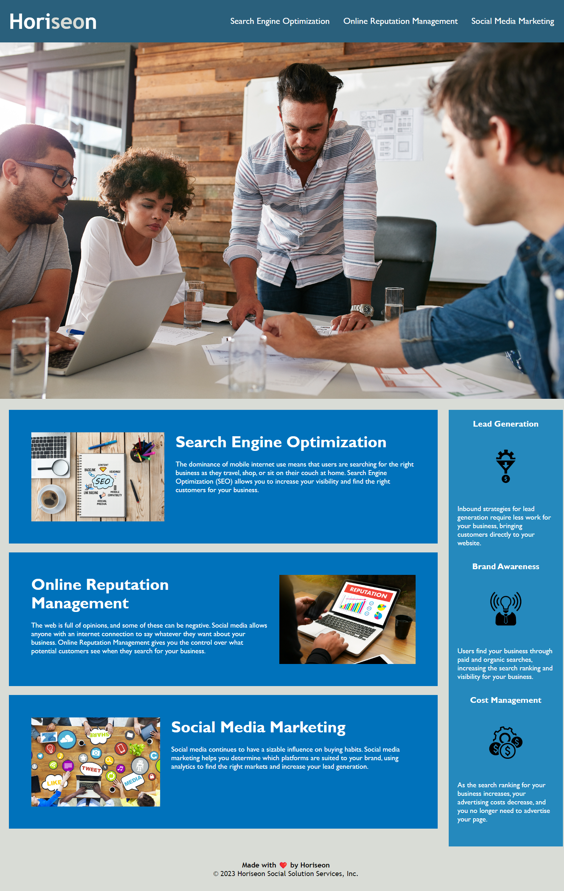

# Challenge-01

## Description

Challenge 01 is a webpage that has been created for a marketing agency; highlighting search engine optimization, online reputation management, and social media marketing. 
I am building this project to meet the customers needs, as well as meet accessibility standards. 
Following accessibility standards helps search engines understand the content on the webpage. This will ulimately make the web page easier for all users. 
By the end of this project, I learned an extensive amount about semantic HTML and the reasons it is good to use. I also learned more about CSS and how to structure the style sheet as well as put in comments. 

## Usage 

Screenshot:

Link:
https://ebcoleman.github.io/Challenge-01/

## Credits

Starter code: https://github.com/coding-boot-camp/urban-octo-telegram

https://coding-boot-camp.github.io/full-stack/github/professional-readme-guide
https://www.educative.io/answers/adding-images-to-readmemd-in-github
https://webaim.org/resources/htmlcheatsheet/HTML%20Semantics%20and%20Accessibility%20Cheat%20Sheet.pdf
https://www.w3schools.com/html/html5_semantic_elements.asp
